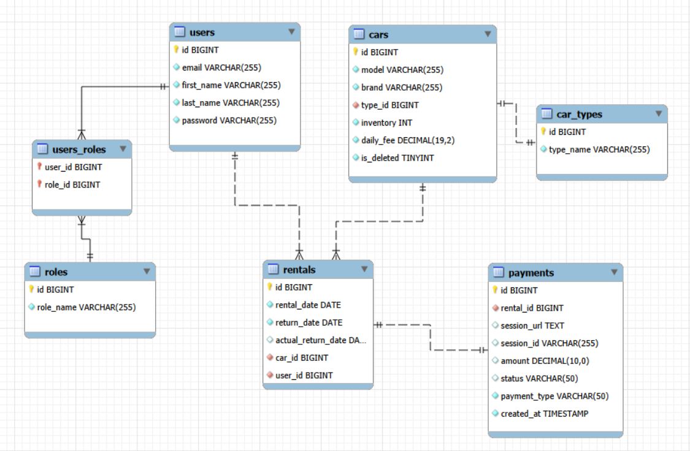
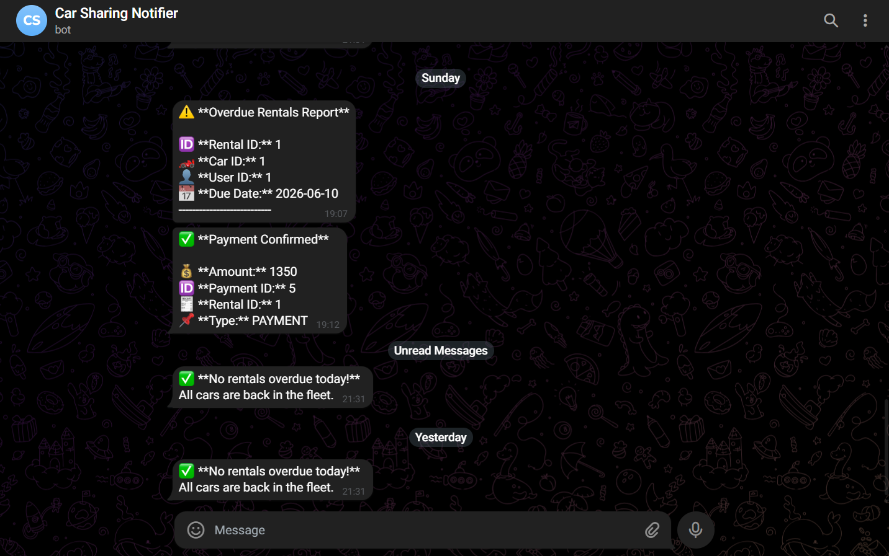
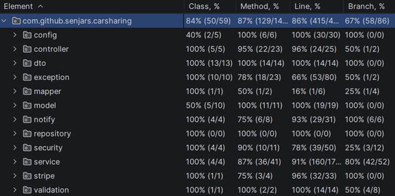

# 🚗 Car Sharing Service

> A production-ready REST API for managing car rentals - built on **Spring Boot 3**, integrated with **Stripe** for payments and **Telegram** for real-time notifications.
> Deployed on **AWS EC2** with **AWS RDS (MySQL)** as the managed database backend.


## 🎬 Demo
> 📽️ **[Watch the video walkthrough](https://www.loom.com/share/a7ad6a1dbc6e4fff9011e4c86ad4df8d)** - covers the full Stripe payment flow, Telegram bot notifications, `@Async` annotation in action, pessimistic locking, and both scheduled tasks.

---


## 📌 What's this about?

This is a backend service for a car-sharing platform - the kind of thing that lets users browse available cars, rent them, pay online, and get notified when something happens. From the admin side, the system tracks overdue rentals, handles fines, and keeps the fleet inventory accurate.

The project is a deliberate showcase of patterns and integrations that come up in real-world backends, things like concurrency-safe inventory management, async processing, scheduled jobs, webhook handling, and external payment flows.

---

## 🛠️ Tech Stack

* **Core Application:**    
* **Data & Persistence:**    
* **Integrations:**   
* **Testing (~140 tests):**    
* **DevOps & Tools:**    
* **Infrastructure (AWS):**   

---

## ✨ Features

### 🔐 Authentication & Authorization
- JWT-based stateless authentication
- Role-based access control (`ROLE_USER`, `ROLE_MANAGER`) enforced with Spring Security
- User registration and login via `/api/auth/register` and `/api/auth/login`

### 🚘 Car Management
- Full CRUD for the car fleet (managers only)
- Inventory tracking with `is_deleted` soft-delete flag
- Car types with separate `car_types` table

### 📋 Rental Management
- Users can rent and return cars via a clean REST interface
- System validates availability and updates inventory atomically
- Rentals track `rental_date`, `return_date`, and `actual_return_date`
- Manager endpoint to manually trigger overdue checks: `POST /api/rentals/trigger-overdue-check`

### 💳 Payment Integration (Stripe)
- Full Stripe Checkout flow: session creation → redirect → webhook → confirmation
- Fine handling for overdue returns (separate `FINE` payment type)
- Payment renewal for expired sessions
- Webhook signature verification for security

### 🤖 Telegram Notifications
- A Telegram bot sends real-time messages to admins on:
    - Successful payments (with amount, payment ID, rental ID, type)
    - Daily overdue rental check results
- Notifications are dispatched **asynchronously** using `@Async` — the main thread doesn't wait

### ⏰ Scheduled Jobs
Two independent schedulers run in the background:
1. **Overdue rental checker** - runs daily, scans for rentals past their return date, notifies via Telegram if any are found (or confirms all cars are back in the fleet)
2. **Expired payment checker** - periodically marks stale `PENDING` sessions as expired

---

## 🗄️ Database Schema

The data model is straightforward but covers everything the business logic needs:



Key design decisions:
- `rentals.actual_return_date` is nullable - it gets set when the car is physically returned
- `cars.is_deleted` enables soft-delete so historical rentals don't lose their car reference
- `payments.payment_type` distinguishes `PAYMENT` from `FINE` (overdue surcharge)
- `payments.session_url` and `session_id` map directly to the Stripe Checkout session

---

## 🔑 Technical Highlights

### `@Async` - non-blocking Telegram notifications

Telegram notifications are sent asynchronously. When a payment is confirmed (via Stripe webhook), the HTTP response goes back to Stripe immediately while the notification is dispatched on a separate thread pool. No blocking, no latency added to the webhook handler.



### Pessimistic Locking - race-condition-safe inventory

When a user rents a car, the system acquires a `PESSIMISTIC_WRITE` lock on the car entity before decrementing inventory. This prevents the classic double-booking issue where two concurrent requests both see `inventory = 1` and both succeed.

### Stripe Webhook Flow

```
User clicks Pay → Stripe Checkout session created
        ↓
User completes payment on Stripe-hosted page
        ↓
Stripe sends POST to /api/payments/webhook (with signature)
        ↓
App verifies signature → updates payment status → sends Telegram notification
```

### Scheduled Tasks with `@Scheduled`

Both schedulers are registered as Spring beans with cron expressions and run independently. The overdue checker is also manually triggerable via a REST endpoint (`POST /api/rentals/trigger-overdue-check`) - useful for testing or one-off admin runs.

---

## 📡 API Overview

Full documentation available at `http://localhost:8080/swagger-ui/index.html` after startup.

**Authentication**
- `POST /api/auth/register` - create a new account
- `POST /api/auth/login` - get your JWT token
  **Cars** *(managers: full CRUD; users: read-only)*
- `GET /api/cars` - list all available cars
- `POST /api/cars` - add a car
- `GET /api/cars/{carId}` - get car details
- `PATCH /api/cars/{carId}` - update car info
- `DELETE /api/cars/{carId}` - soft-delete a car
  **Rentals**
- `GET /api/rentals` - get all rentals (managers see all, users see their own)
- `POST /api/rentals` - rent a car
- `POST /api/rentals/return` - return a car
- `GET /api/rentals/{rentalId}` - get a specific rental
- `POST /api/rentals/trigger-overdue-check` - manually trigger the overdue scheduler
  **Payments**
- `GET /api/payments` - get all payments
- `POST /api/payments` - create a Stripe checkout session
- `POST /api/payments/webhook` - Stripe webhook handler
- `POST /api/payments/renew` - renew an expired payment session
- `GET /api/payments/success` - handle successful payment redirect
- `GET /api/payments/cancel` - handle cancelled payment redirect
  **Users**
- `GET /api/users/me` - get your profile
- `PATCH /api/users/me` - update your profile
- `PUT /api/users/{userId}/role` - change a user's role (managers only)
> All endpoints except `/api/auth/**` require a valid JWT. In Swagger, click **Authorize** and paste your token.

---

## ☁️ Deployment (AWS)

The application is deployed on AWS using a standard two-tier setup:

- **EC2** — the Spring Boot app runs on an EC2 instance inside Docker. The instance is configured with the appropriate security groups to expose port 8080 publicly and allow outbound connections to RDS.
- **RDS (MySQL)** - the database runs on a managed AWS RDS instance. The app connects to it via the standard JDBC URL - Liquibase runs migrations on startup automatically, so there's no manual schema setup needed.
  The Stripe webhook endpoint (`/api/payments/webhook`) is publicly reachable, which is required for Stripe to deliver payment events. The `APP_URL` environment variable points to the EC2 public address so Stripe redirect URLs resolve correctly after checkout.

> ️️️☁️ **[Explore Live API (Swagger UI)](http://3.68.72.235:8080/swagger-ui/index.html#/)** (If you want to run it locally instead, just follow the Docker Compose setup below.)

---

## 🚀 Getting Started

### Prerequisites

- Java 21
- Docker & Docker Compose
- A Stripe account (test mode is fine) with a webhook set up
- A Telegram bot token and chat ID
### 1. Clone the repo

```bash
git clone https://github.com/Senjars/jv-portfolio-car-sharing-service.git
cd jv-portfolio-car-sharing-service
```

### 2. Set up environment variables

Copy the sample file and fill in your values:

```bash
cp .env.sample .env
```

```env
# Database
DB_URL=jdbc:mysql://localhost:3306/carsharing_db
DB_USERNAME=your_db_user_here
DB_PASSWORD=your_db_password_here
 
# JWT
JWT_SECRET=your_jwt_secret_key_min_32_chars
JWT_EXPIRATION=86400000
 
# Stripe
STRIPE_SECRET_KEY=your_stripe_secret_key_here
STRIPE_WEBHOOK_SECRET=your_stripe_webhook_secret_here
APP_URL=http://localhost:8080
 
# Telegram
TELEGRAM_BOT_TOKEN=your_telegram_bot_token_here
TELEGRAM_CHAT_ID=your_telegram_chat_id_here
TELEGRAM_BOT_USERNAME=your_telegram_bot_username_here
```

### 3. Start with Docker Compose

```bash
docker-compose up --build
```

The app starts on `http://localhost:8080`.

### 4. Explore the API

Open Swagger UI: [http://localhost:8080/swagger-ui/index.html](http://localhost:8080/swagger-ui/index.html)

Register a user, grab the JWT from the login response, click **Authorize** in Swagger, and you're good to go.

### 5. Test Stripe payments locally

To receive webhook events locally, use the Stripe CLI:

```bash
stripe listen --forward-to localhost:8080/api/payments/webhook
```

Use Stripe's test card `4242 4242 4242 4242` with any future expiry and any CVC.

The project uses Testcontainers to spin up a real MySQL instance during integration tests — no mocking the database, no H2 workarounds for MySQL-specific behavior.

```bash
# Run all tests with coverage report
mvn clean verify
```



Coverage report lands in `target/site/jacoco/index.html`.
